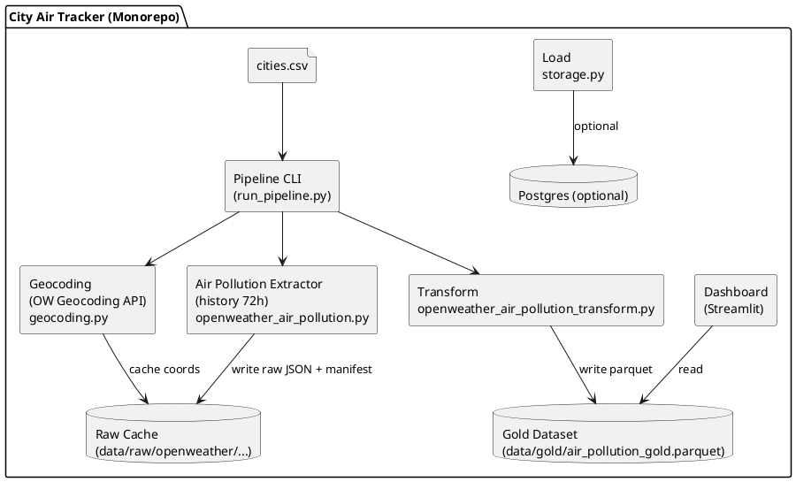

# Architecture (OpenWeather 72h History)

## Component diagram (PlantUML)



## Sequence diagram (PlantUML)

```plantuml
@startuml
actor User
participant "run_pipeline.py" as CLI
participant "geocoding.py" as GEO
participant "openweather_air_pollution.py" as EX
participant "transform" as TR
participant "load" as LD
database "data/raw" as RAW
database "data/gold" as GOLD
database "Postgres" as PG
file "configs/cities.csv" as CITIES

User -> CLI: run --history-hours 72
CLI -> CITIES: read list
loop per city
  CLI -> GEO: city+country -> lat/lon
  GEO -> RAW: cache geocode result
  CLI -> EX: fetch history(lat,lon,start,end)
  EX -> RAW: write response json + manifest
end
CLI -> TR: parse raw json -> tidy DF
TR -> GOLD: write parquet
CLI -> LD: optionally publish to DB
LD -> PG: write table (if enabled)
@enduml
```
