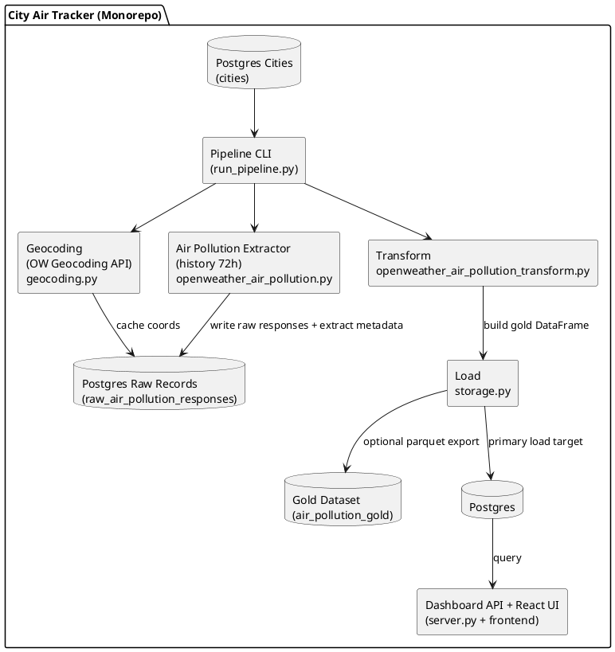
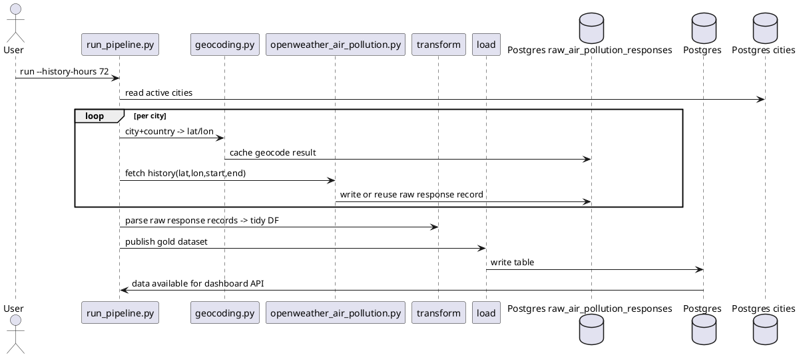

# Architecture (OpenWeather 72h History)

## Component diagram (PlantUML)

```plantuml
@startuml
skinparam componentStyle rectangle

package "City Air Tracker (Monorepo)" {
  [Pipeline CLI\n(run_pipeline.py)] as cli
  component "Geocoding\n(OW Geocoding API)\ngeocoding.py" as geo
  component "Air Pollution Extractor\n(history 72h)\nopenweather_air_pollution.py" as ex
  component "Transform\nopenweather_air_pollution_transform.py" as tr
  component "Load\nstorage.py" as ld
  database "Postgres Raw Records\n(raw_air_pollution_responses)" as raw
  database "Gold Dataset\n(air_pollution_gold)" as gold
  database "Postgres" as pg
  component "Dashboard API + React UI\n(server.py + frontend)" as dash
  database "Postgres Cities\n(cities)" as cities
}

cities --> cli
cli --> geo
geo --> raw : cache coords
cli --> ex
ex --> raw : write raw responses + extract metadata
cli --> tr
tr --> ld : build gold DataFrame
ld --> gold : optional parquet export
ld --> pg : primary load target
pg --> dash : query

@enduml
```

## Sequence diagram (PlantUML)

```plantuml
@startuml
actor User
participant "run_pipeline.py" as CLI
participant "geocoding.py" as GEO
participant "openweather_air_pollution.py" as EX
participant "transform" as TR
participant "load" as LD
database "Postgres raw_air_pollution_responses" as RAW
database "Postgres" as PG
database "Postgres cities" as CITIES

User -> CLI: run --history-hours 72
CLI -> CITIES: read active cities
loop per city
  CLI -> GEO: city+country -> lat/lon
  GEO -> RAW: cache geocode result
  CLI -> EX: fetch history(lat,lon,start,end)
  EX -> RAW: write or reuse raw response record
end
CLI -> TR: parse raw response records -> tidy DF
CLI -> LD: publish gold dataset
LD -> PG: write table
PG -> CLI: data available for dashboard API
@enduml
```
