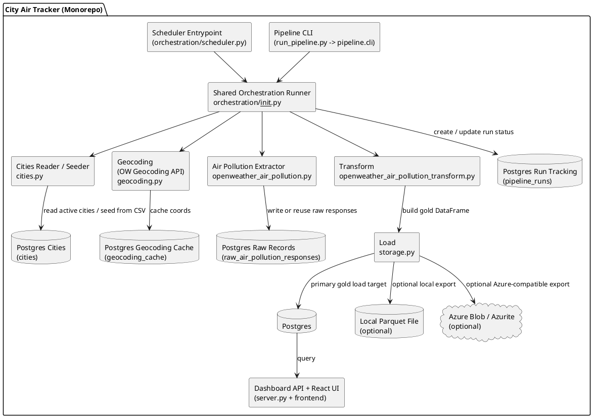
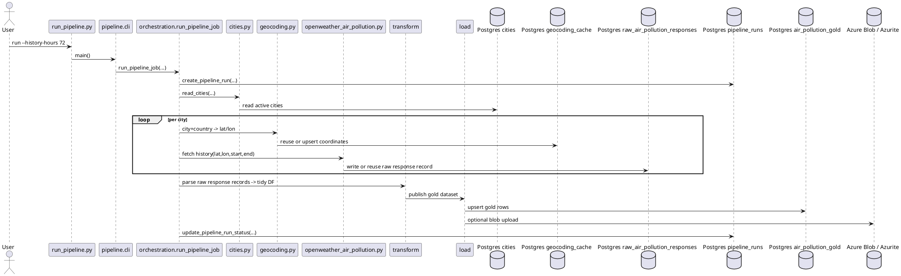

# Architecture (Current Runtime)

## Component diagram (PlantUML)

```plantuml
@startuml
skinparam componentStyle rectangle

package "City Air Tracker (Monorepo)" {
  [Pipeline CLI\n(run_pipeline.py -> pipeline.cli)] as cli
  [Scheduler Entrypoint\n(orchestration/scheduler.py)] as sched
  component "Shared Orchestration Runner\norchestration/__init__.py" as orch
  component "Cities Reader / Seeder\ncities.py" as citiesmod
  component "Geocoding\n(OW Geocoding API)\ngeocoding.py" as geo
  component "Air Pollution Extractor\nopenweather_air_pollution.py" as ex
  component "Transform\nopenweather_air_pollution_transform.py" as tr
  component "Load\nstorage.py" as ld
  database "Postgres Cities\n(cities)" as cities
  database "Postgres Geocoding Cache\n(geocoding_cache)" as geocache
  database "Postgres Raw Records\n(raw_air_pollution_responses)" as raw
  database "Postgres Run Tracking\n(pipeline_runs)" as runs
  database "Postgres" as pg
  database "Local Parquet File\n(optional)" as parquet
  cloud "Azure Blob / Azurite\n(optional)" as blob
  component "Dashboard API + React UI\n(server.py + frontend)" as dash
}

cli --> orch
sched --> orch
orch --> citiesmod
citiesmod --> cities : read active cities / seed from CSV
orch --> geo
geo --> geocache : cache coords
orch --> ex
ex --> raw : write or reuse raw responses
orch --> tr
tr --> ld : build gold DataFrame
orch --> runs : create / update run status
ld --> pg : primary gold load target
ld --> parquet : optional local export
ld --> blob : optional Azure-compatible export
pg --> dash : query

@enduml
```

## Sequence diagram (PlantUML)

```plantuml
@startuml
actor User
participant "run_pipeline.py" as CLI
participant "pipeline.cli" as PCLI
participant "orchestration.run_pipeline_job" as ORCH
participant "cities.py" as CITIESMOD
participant "geocoding.py" as GEO
participant "openweather_air_pollution.py" as EX
participant "transform" as TR
participant "load" as LD
database "Postgres cities" as CITIES
database "Postgres geocoding_cache" as GEOCACHE
database "Postgres raw_air_pollution_responses" as RAW
database "Postgres pipeline_runs" as RUNS
database "Postgres air_pollution_gold" as GOLD
database "Azure Blob / Azurite" as BLOB

User -> CLI: run --history-hours 72
CLI -> PCLI: main()
PCLI -> ORCH: run_pipeline_job(...)
ORCH -> RUNS: create_pipeline_run(...)
ORCH -> CITIESMOD: read_cities(...)
CITIESMOD -> CITIES: read active cities
loop per city
  ORCH -> GEO: city+country -> lat/lon
  GEO -> GEOCACHE: reuse or upsert coordinates
  ORCH -> EX: fetch history(lat,lon,start,end)
  EX -> RAW: write or reuse raw response record
end
ORCH -> TR: parse raw response records -> tidy DF
TR -> LD: publish gold dataset
LD -> GOLD: upsert gold rows
LD -> BLOB: optional blob upload
ORCH -> RUNS: update_pipeline_run_status(...)
@enduml
```
