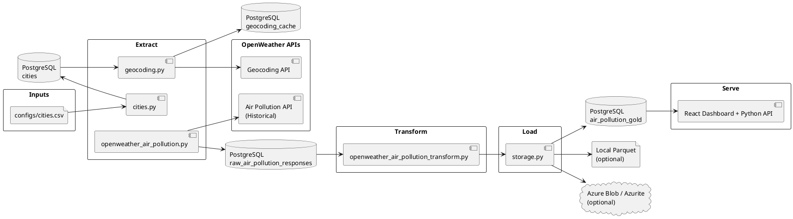

# Data Flow Diagram

```plantuml
@startuml
left to right direction

rectangle "Inputs" {
  file "configs/cities.csv" as CITIES
}

rectangle "OpenWeather APIs" {
  [Geocoding API] as GEOAPI
  [Air Pollution API\n(Historical)] as AIRAPI
}

rectangle "Extract" {
  [cities.py] as CITIESMOD
  [geocoding.py] as GEO
  [openweather_air_pollution.py] as EX
}

database "PostgreSQL\ncities" as CITYDB
database "PostgreSQL\ngeocoding_cache" as GEOCACHE
database "PostgreSQL\nraw_air_pollution_responses" as RAW

rectangle "Transform" {
  [openweather_air_pollution_transform.py] as TR
}

rectangle "Load" {
  [storage.py] as LOAD
}

database "PostgreSQL\nair_pollution_gold" as GOLD
file "Local Parquet\n(optional)" as PARQUET
cloud "Azure Blob / Azurite\n(optional)" as BLOB
rectangle "Serve" {
  [React Dashboard + Python API] as DASH
}

CITIES --> CITIESMOD
CITIESMOD --> CITYDB
CITYDB --> GEO
GEO --> GEOAPI
GEO --> GEOCACHE

EX --> AIRAPI
EX --> RAW

RAW --> TR
TR --> LOAD
LOAD --> GOLD
LOAD --> PARQUET
LOAD --> BLOB

GOLD --> DASH
@enduml
```
