# Function Call Flows

This document describes the current function-level runtime flows on `main`.
It is meant to answer: "when I run the app, which functions call which other functions, and in what order?"

## Scope

The diagrams below cover:

- pipeline CLI entrypoint
- scheduler-compatible entrypoint
- city seeding flow
- pipeline run orchestration
- geocoding cache hit and miss behavior
- raw air-pollution extract cache hit and miss behavior
- transform flow
- load flow
- dashboard frontend to backend flow

## 1. Pipeline CLI Run Flow

Source files:

- `services/pipeline/run_pipeline.py`
- `services/pipeline/src/pipeline/cli.py`
- `services/pipeline/src/pipeline/orchestration/__init__.py`

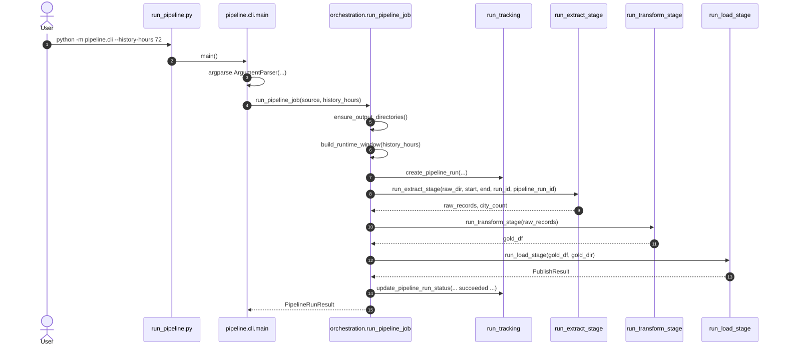

## 1.1 Scheduler-Compatible Run Flow

Source file:

- `services/pipeline/src/pipeline/orchestration/scheduler.py`

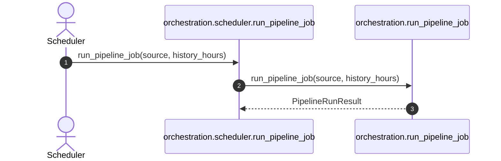

Note:

- `scheduler.py` is a temporary compatibility wrapper; Prefect is now the active orchestration direction.
- Recurring job registration and cadence configuration are follow-up capabilities to be implemented via Prefect deployments.

## 2. Seed Cities Flow

This flow runs when the CLI is invoked with `--seed-cities`.

Source file:

- `services/pipeline/src/pipeline/extract/cities.py`

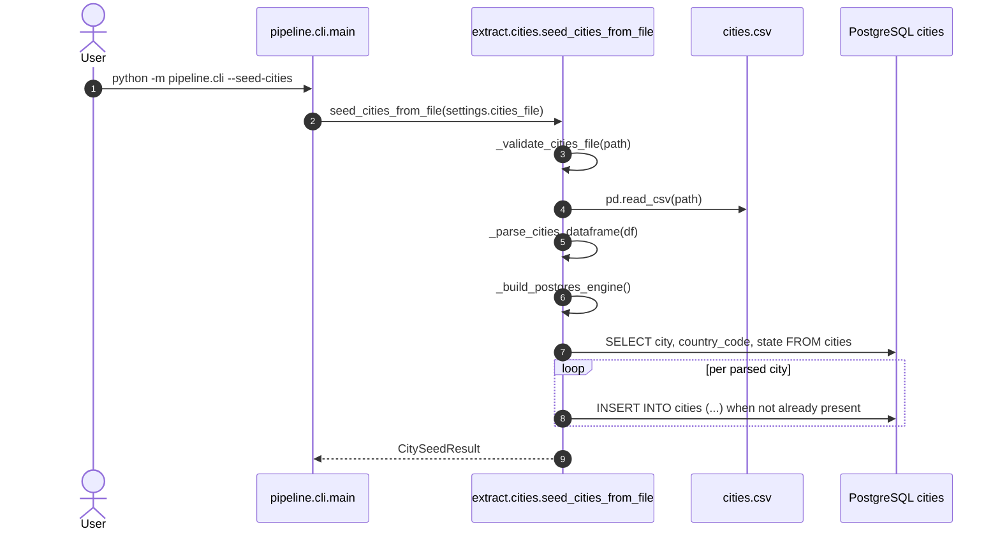

## 3. Extract Stage Flow

The extract stage is coordinated by `run_extract_stage()` and loops through each active city.

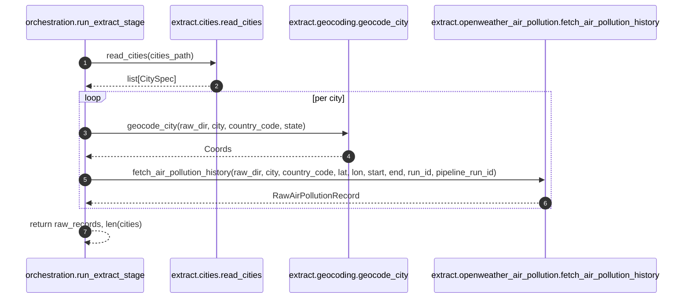

## 4. Geocoding Flow

### 4.1 Cache Hit

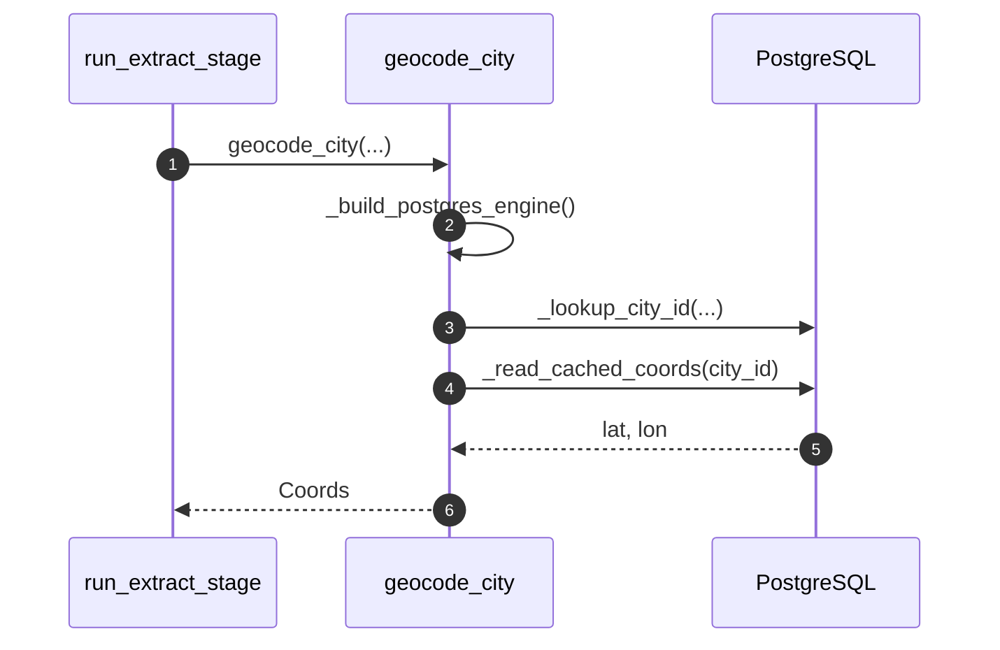

### 4.2 Cache Miss

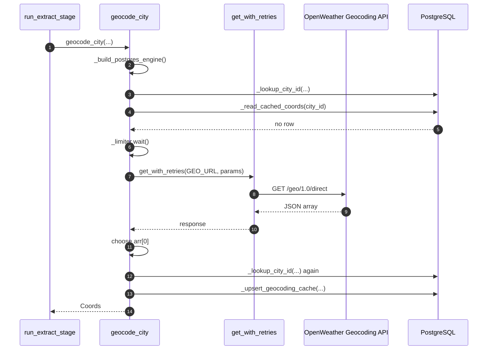

## 5. Raw Air-Pollution Extract Flow

### 5.1 Existing Raw Response Reused

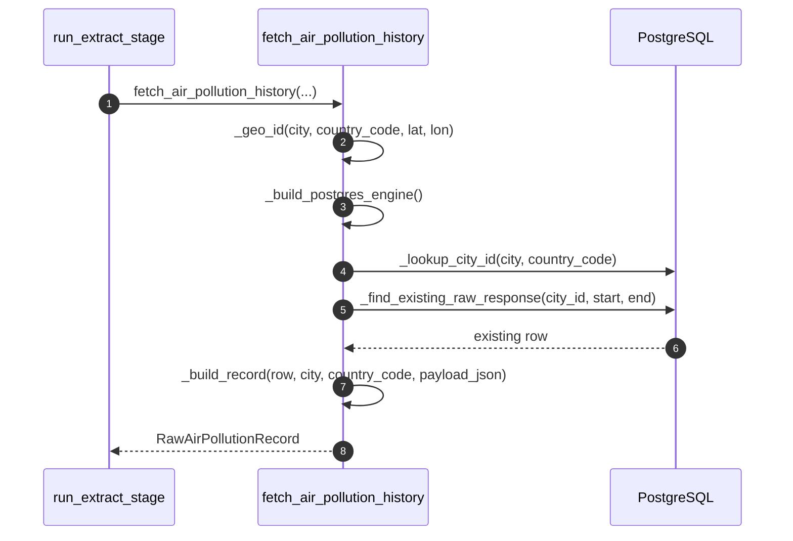

### 5.2 New Raw Response Inserted

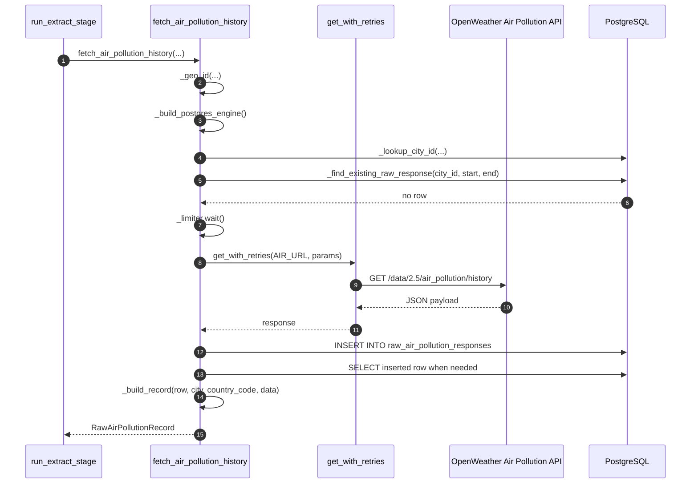

## 6. Transform Flow

The transform stage does not read from PostgreSQL directly.
It receives `list[RawAirPollutionRecord]` from orchestration and builds a DataFrame in memory.

Source files:

- `services/pipeline/src/pipeline/transform/openweather_air_pollution_transform.py`
- `services/pipeline/src/pipeline/transform/risk_scoring.py`

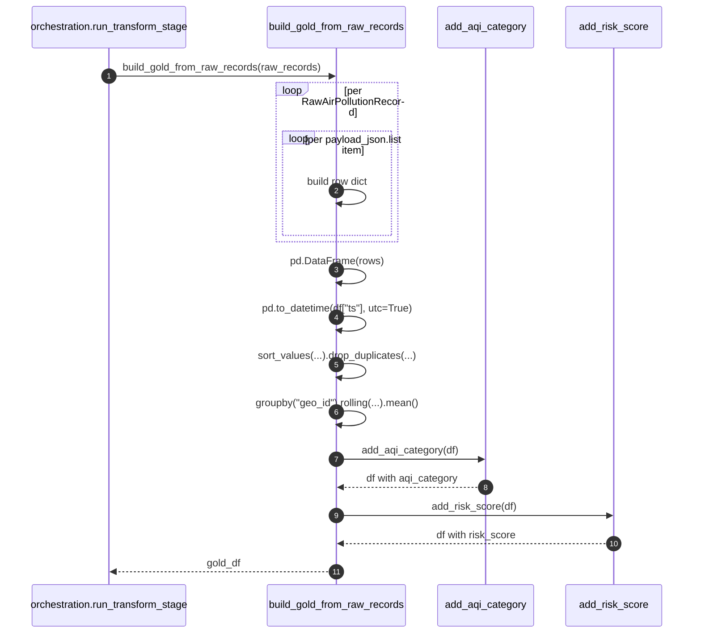

## 7. Load Flow

The load stage is the point where the in-memory DataFrame is persisted again.

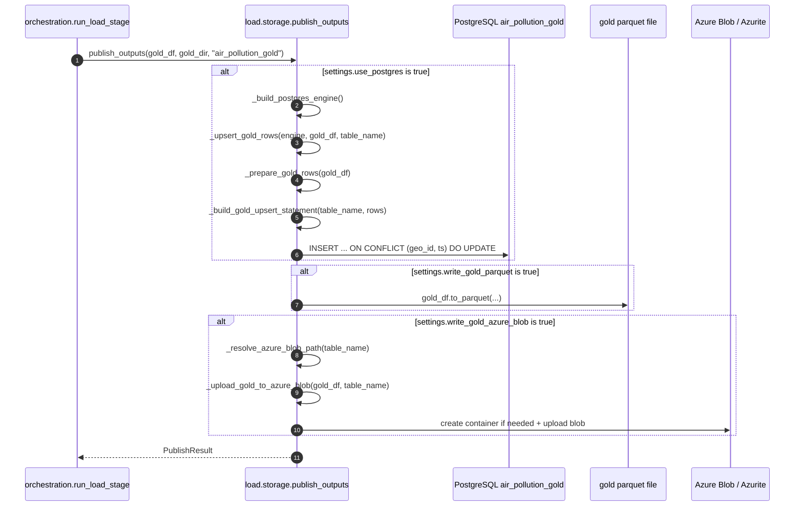

## 8. Pipeline Success and Failure Status Updates

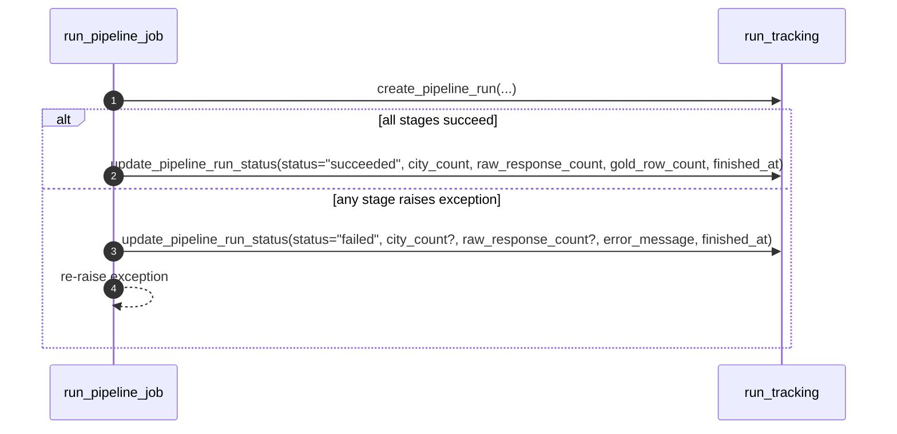

## 9. Dashboard Frontend Load Flow

Source files:

- `services/dashboard/frontend/src/main.jsx`
- `services/dashboard/frontend/src/App.jsx`
- `services/dashboard/frontend/src/hooks/useDashboardViewModel.js`
- `services/dashboard/frontend/src/hooks/useDashboardData.js`
- `services/dashboard/frontend/src/hooks/useLocalStorageState.js`

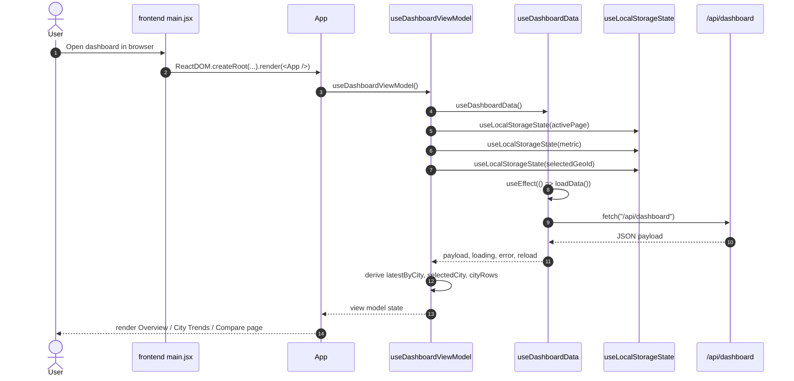

## 10. Dashboard Backend Request Flow

Source file:

- `services/dashboard/server.py`

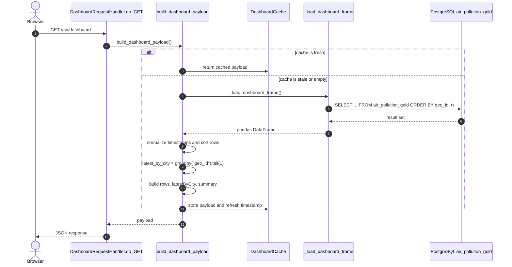

## 11. Call Graph Summary

The main happy-path function chain for the ETL pipeline is:

1. `run_pipeline.py`
2. `pipeline.cli.main()`
3. `orchestration.run_pipeline_job()`
4. `run_tracking.create_pipeline_run()`
5. `orchestration.run_extract_stage()`
6. `extract.cities.read_cities()`
7. `extract.geocoding.geocode_city()`
8. `extract.openweather_air_pollution.fetch_air_pollution_history()`
9. `orchestration.run_transform_stage()`
10. `transform.openweather_air_pollution_transform.build_gold_from_raw_records()`
11. `transform.risk_scoring.add_aqi_category()`
12. `transform.risk_scoring.add_risk_score()`
13. `orchestration.run_load_stage()`
14. `load.storage.publish_outputs()`
15. `run_tracking.update_pipeline_run_status()`

## 12. Important Runtime Notes

- PostgreSQL is the system of record for `cities`, `geocoding_cache`, `pipeline_runs`, `raw_air_pollution_responses`, and `air_pollution_gold`.
- The handoff from extract to transform to load is not DB-to-DB. It happens as Python objects and a pandas DataFrame in memory.
- `raw_dir` is still passed around by orchestration, but `fetch_air_pollution_history()` currently ignores it.
- Local Parquet and Azure Blob publishing are optional secondary outputs; PostgreSQL remains the primary gold-data target.
- Prefect is the active orchestration direction; `scheduler.py` remains as a temporary compatibility shim during the transition.
- Configurable recurring scheduling via Prefect deployments is a follow-up capability.
- The dashboard backend reads only from `air_pollution_gold`; it does not call pipeline code directly.
