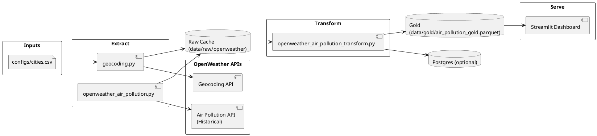

# Data Flow Diagram

```plantuml
@startuml
left to right direction

rectangle "Inputs" {
  file "configs/cities.csv" as CITIES
}

rectangle "OpenWeather APIs" {
  [Geocoding API] as GEOAPI
  [Air Pollution API\n(Historical)] as AIRAPI
}

rectangle "Extract" {
  [geocoding.py] as GEO
  [openweather_air_pollution.py] as EX
}

database "Raw Cache\n(data/raw/openweather)" as RAW

rectangle "Transform" {
  [openweather_air_pollution_transform.py] as TR
}

database "Gold\n(data/gold/air_pollution_gold.parquet)" as GOLD
database "Postgres (optional)" as PG
rectangle "Serve" {
  [Streamlit Dashboard] as DASH
}

CITIES --> GEO
GEO --> GEOAPI
GEO --> RAW

EX --> AIRAPI
EX --> RAW

RAW --> TR
TR --> GOLD
TR --> PG

GOLD --> DASH
@enduml
```
